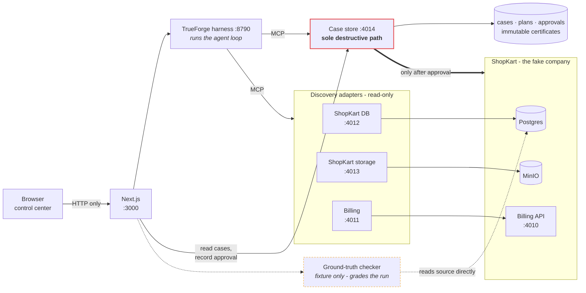

# Right2Erase

An agent that carries out a GDPR right-to-erasure request across four systems,
and cannot delete anything until a human approves - and can read - the exact
plan it rehearsed.


**Demo video:** <https://youtu.be/DD4SNvi9CEw> (3 minutes)

<details>
<summary>Requirement is met</summary>

| Requirement                          | Where it is met                                                                                                                                                                                                                                                                 |
| ------------------------------------ | ------------------------------------------------------------------------------------------------------------------------------------------------------------------------------------------------------------------------------------------------------------------------------- |
| Agent runs on the TrueForge harness  | [How the TrueForge harness is used](#how-the-trueforge-harness-is-used) - the loop, MCP-only tool surface, and the approval pause are all TrueForge's                                                                                                                           |
| A real tool reached                  | Four MCP servers registered with the harness; the agent has no other way to touch ShopKart                                                                                                                                                                                      |
| Code run in a sandbox                | Every plan is rehearsed against a throwaway SQLite snapshot carrying ShopKart's production foreign keys, before a human sees it - see [What you'll see](#what-youll-see). The TrueForge sandbox itself is off, [for a reason worth reading](#how-the-trueforge-harness-is-used) |
| A pause before anything irreversible | `require_approval_for_tools` suspends the run on `oubliette_execute_erasure`; nothing is deleted without a typed human approval                                                                                                                                                 |
| Qodo-reviewed pull requests          | [Qodo Code Review Evidence](#qodo-code-review-evidence)                                                                                                                                                                                                                         |
| Public repo, functional README       | This file; MIT licensed                                                                                                                                                                                                                                                         |

</details>

## The problem

"Delete my data" sounds like one operation. It is not. A single customer's
personal data is scattered across every system a company runs, and the pieces do
not agree with each other:

- **It hides behind old identities.** People change their email address. The
  account row moves on; the log entries filed under the old address do not.
  Search for the current email and you will confidently miss five months of
  history.
- **Some of it is not linked to anything.** A return receipt in object storage
  can have no foreign key back to the account at all - reachable only by a
  string inside its file path. A cascade delete never touches it.
- **Some of it must survive.** An open refund is a live financial obligation.
  Regulators require erasure; they also require you to keep records of money you
  still owe. Deleting it to satisfy one rule breaks the other.
- **Other people get caught in the net.** Two customers can share a display
  name. Match on the wrong field and you erase a stranger, which is the one
  mistake with no undo.
- **Order matters.** Delete an order before its line items and the database
  refuses. Delete in the wrong order across systems and you are left half-erased
  with no way back.

Handing this to an LLM makes it worse, not better. A model that is 95% right is
not 95% compliant - it is a system that quietly destroys the wrong person's data
one time in twenty, and produces no evidence of what it did.

## The five traps

Those five problems are not described in the abstract. Each one is deliberately
planted in ShopKart, the fake company the agent investigates, and the demo
succeeds only if the agent walks through all five:

| #   | Trap               | What it punishes                                                                                                  | Getting it wrong looks like                                         |
| --- | ------------------ | ----------------------------------------------------------------------------------------------------------------- | ------------------------------------------------------------------- |
| 1   | **Ordering**       | Orders, their line items and their refunds are chained together. Deleting from the top down is rejected outright. | A half-finished erasure that cannot be resumed or undone.           |
| 2   | **Retention hold** | One order carries an unsettled refund - money still owed - while a settled one nearby is safe to remove.          | Destroying the record of a live debt, or timidly keeping both.      |
| 3   | **Name collision** | A second, unrelated customer shares the subject's display name.                                                   | Erasing a stranger. The one mistake with no undo.                   |
| 4   | **Orphaned file**  | A return receipt in object storage has no link back to the account except a string in its path.                   | Reporting success while the customer's data is still sitting there. |
| 5   | **Identity chain** | The subject changed email address; months of history are still filed under the old one.                           | A confident, complete-looking erasure that misses half the data.    |

Traps 2 and 3 are the interesting ones, because they punish over-deleting
rather than under-deleting. An agent that simply deletes everything it can find
fails this demo just as hard as one that gives up early.

## How Right2Erase solves it

The safety of this system does not depend on the agent behaving well. It depends
on what the agent is able to do at all - and it is able to do very little. The
guarantees hold no matter how badly the model reasons, and hold identically
whether a language model or a fixed script is driving the investigation.

**The agent is never given a delete button.** Everything it uses to search the
company's systems can only read. There is exactly one way to destroy anything in
the entire system, and it will not run unless a human has already approved that
precise plan. Change so much as one record after approval and the approval no
longer matches, so execution refuses.

**Nothing is deleted that was not first proven safe.** Before a human is even
asked, the subject's records are copied into a disposable replica of the
company's database, and the deletion is performed there and immediately undone.
If the order is wrong, it breaks against the copy instead of against real
customer data. A plan that has not survived that rehearsal is never offered for
approval.

**Records that must survive cannot be deleted by mistake.** An open refund is
filed as protected the moment it is discovered, regardless of what the agent
thinks should happen to it, and any plan claiming to delete one is thrown out.
The agent is not trusted to remember the rule, because it is not the agent's
rule to remember.

**The agent cannot invent its own vocabulary.** It must describe every record it
finds using a fixed list of terms. Those terms determine where a record lives
and how it is treated, so allowing the agent to phrase things its own way would
have let a single careless word route a record somewhere nobody intended.

**Anything ambiguous stops the run.** If an email address matches two different
people, the system refuses to guess which one you meant. If a search cannot
return its complete results, it fails rather than returning some of them,
because a partial answer looks exactly like a complete one - and planning an
erasure from it silently leaves the customer's data behind.

**Every run leaves evidence that cannot be edited afterwards.** Completing an
erasure issues a permanent certificate recording who approved it and what each
system actually confirmed deleting. Nothing can alter or remove it later.
Separately, an independent checker works out the correct answer directly from
the source data, by a route the agent has no access to, and scores the agent's
plan against it - so the demo can show whether the agent was right, rather than
asking you to take its word for it.

## What you'll see

You type one email address and press **Open erasure case**. Everything below is
a real run against the seeded fixture - these are the actual numbers.

**The agent investigates.** It resolves who the subject is, refuses to continue
if that is ambiguous, then searches all four systems: the database, object
storage, the billing provider, and the event log - including under the
subject's previous email address. The rail on the left fills in as it goes.

**It builds a plan and rehearses it.** The plan comes to **32 deletions and one
record withheld**. The rehearsal runs against a throwaway copy and the first
attempt _fails_ - a foreign-key violation, exactly as trap 1 intends - then
retries in the correct leaf-to-root order and passes. Both attempts are shown;
the failure is not hidden, because the recovery is the point.

**It stops.** Nothing has been deleted. The screen shows what will be destroyed,
what will not, and why - the unsettled refund on order SK-08004 is held back
with its reason. The only way forward is a human typing their name and
confirming twice.

**And you can read the plan before you sign it.** Not a summary of it - the
plan itself, every record it will delete, named the way the business names
things rather than by row id.


This is where the identity chain stops being a claim. The event log shows four
entries under `ravi.s@oldmail.example`, dated up to August 2024, and four under
the current address from October 2024 onward - the subject changed email in
between. An agent that searched only the address you typed in would have found
half of them and reported success.

It is also where the plan hash becomes meaningful. The hash covers exactly the
records on screen, and Right2Erase re-derives it before executing, so an
approval cannot be replayed against a plan the operator never saw.

**You approve, and it executes.** Each adapter reports what it actually deleted,
and a certificate is issued that nothing can later edit. The same record-by-record
list is available here too, because "what was deleted" is a question that
outlives the moment of approving it.


**Then it is checked against an answer the agent never had access to.** A
separate checker derives the correct result straight from the source database
and scores the plan line by line - including confirming the namesake account was
never touched.


That last panel is the difference between a demo that claims it worked and one
that shows it. It is also what caught a real bug during development: the plan
looked correct and only the checker disagreed.

## Architecture

The thick edge is the only one that destroys anything, and it is the only edge
gated on a human. Everything the agent reaches is a read-only adapter; the
checker that grades its work sits outside the agent's reach entirely.



Three things the diagram is meant to make obvious:

- **The browser never touches MCP.** Every call goes through Next.js route
  handlers. The adapters serve no CORS headers and enforce an origin allowlist,
  so a page in a browser cannot reach them even if it tried.
- **The agent's reach is the adapters, and nothing else.** Whatever drives the
  loop - the model, or the deterministic fallback that can stand in for it -
  plugs into the same box and inherits the same limits. Changing who decides
  what to search changes nothing about what is reachable.
- **The checker is scaffolding, not a component.** It reads the source data
  directly, by a route no tool exposes, so it can grade the plan without the
  agent being able to influence the answer. It exists only because ShopKart is a
  fixture whose correct answer is knowable in advance - a real deployment has no
  oracle to check against, which is precisely why the rest of the diagram has to
  hold on its own.

## How the TrueForge harness is used

[TrueForge](https://trueforge.dev) runs the agent loop. It is not a wrapper this
project wrote around a model - it owns the parts that are genuinely hard to get
right, so this repo can spend its complexity on the safety boundary instead.

What TrueForge provides:

- **The loop itself** - model calls, tool dispatch, retries, and context
  compaction across an investigation that runs to dozens of tool calls.
- **MCP as the only interface.** The four adapters are registered as remote MCP
  servers. The model reaches ShopKart exclusively through them, so the read-only
  annotations and closed enums are not advice - they are the entire surface the
  agent has.
- **The approval pause.** `require_approval_for_tools` names
  `oubliette_execute_erasure`, so the harness suspends the turn mid-run when the
  agent tries to execute, and resumes it only when the control center submits a
  decision. The human gate is a property of the runtime, not something the agent
  chooses to respect.
- **Credential custody.** The model key is handed to TrueForge, which stores it
  in its own settings and returns it redacted. Nothing in this repo writes it to
  disk.

The agent is declared in `agent/oubliette-agent.json` - its instructions, model,
which tools each server exposes, and which of them require approval.
`scripts/trueforge-bootstrap.mjs` registers that definition, the four MCP
servers, and the model provider over TrueForge's API, so **the TrueForge UI is
never needed to configure anything**. It is idempotent: re-run it after editing
the agent.

### Why the TrueForge sandbox is off, and what runs instead

This is the one harness feature Right2Erase deliberately does not use, so it is
worth being direct about why.

Turning the sandbox on also turns on Code Mode, which routes every MCP call
through a generic `call_tool` wrapper. `require_approval_for_tools` matches on
the tool name the model asks for - and with the wrapper in the way, that name is
always `call_tool`, never `oubliette_execute_erasure`. **Verified empirically:
with the sandbox enabled, asking the agent to execute the erasure produced no
`tool.approval_required` event at all.** The harness would have deleted a real
customer's data without ever pausing.

Given a choice between sandboxed code execution and a human gate on an
irreversible delete, this project takes the gate every time. The finding is
recorded in `agent/oubliette-agent.json` next to the setting itself, so the next
person to reach for it knows what it costs.

Sandboxed execution is not lost, only moved somewhere the safety argument
survives. Every plan is rehearsed against a **throwaway SQLite snapshot** of the
subject's records - a self-contained file that mirrors the foreign-key
constraints of ShopKart's production Postgres schema - and the deletion is run
there inside a transaction that is always rolled back, before any human is asked
to approve it. In the demo run that
rehearsal _fails_ on first attempt with a foreign-key violation and passes on
retry in leaf-to-root order, which is exactly the class of bug a sandbox exists to
catch. A plan that has not survived it is never offered for approval, and the
snapshot is destroyed afterwards because it is itself a full copy of the person's
data.

One smaller configuration note, also found the hard way: **tools are not
preloaded**, so TrueForge dispatches them through a `call_tool` wrapper and
reports that wrapper's name on the event stream. `web/lib/trueforge-runs.ts`
unwraps it to recover the real tool, which is what drives the phase rail, the
case id, and the rehearsal transcript.

## Repository

- `fixture/` - ShopKart fake services, schema, seed data, and operator-only truth checker
- `mcp/` - agent-facing MCP adapters for the fake services
- `agent/` - both engines: the deterministic script (`trueforge-agent.js`, `create-agent.js`) and the TrueForge agent definition (`oubliette-agent.json`)
- `src/` - Right2Erase: the case store, plans, approvals, and the sole destructive path
- `web/` - the Data Erasure Control Center (Next.js)
- `docs/images/` - the screenshots used in this README
- `Dockerfile`, `railway.json`, `scripts/railway-*.sh` - the single-container deployment

## Qodo Code Review Evidence

Every change to this project after the initial commit arrived through a
Qodo-reviewed pull request - `main` is 17 merge commits and nothing else, with no
direct pushes. Qodo reviews each PR automatically and re-reviews on every
subsequent push, so the final review always ran against the code that actually
shipped. Two are worth reading in full.

The clearest example is
[PR #18](https://github.com/senali-d/Right2Erase/pull/18), which touches the
code that turns a bare event-log row into the human-readable record shown on
the approval screen. Qodo surfaced that event ids were cast to Postgres
`int` when the column is actually `bigserial` (silently breaking above
2,147,483,647), that canonicalised ids with leading zeros never matched what
Postgres returns, and that deduplication happened after a lookup cap instead
of before it, letting duplicate ids crowd out real ones. All three were
fixed, not dismissed - each in its own commit before merge:

| Review round  | Finding                                                      | Fix commit                                                                                                                        |
| ------------- | ------------------------------------------------------------ | --------------------------------------------------------------------------------------------------------------------------------- |
| 1 (07:23 UTC) | event ids cast to `int`, not `bigint`                        | [`987824b`](https://github.com/senali-d/Right2Erase/commit/987824b) keep event_log ids as bigint through the display lookup       |
| 2 (07:31 UTC) | leading-zero ids never match; oversized ids abort enrichment | [`f55da9a`](https://github.com/senali-d/Right2Erase/commit/f55da9a) canonicalise event ids and drop unusable ones before querying |
| 3 (07:46 UTC) | duplicate ids consumed the lookup cap before dedup           | [`c8f1e1b`](https://github.com/senali-d/Right2Erase/commit/c8f1e1b) deduplicate event ids before applying the lookup cap          |

Rounds 2 and 3 each found a new bug that only existed because of the previous
round's own fix, and the PR merged as
[`bca299b`](https://github.com/senali-d/Right2Erase/commit/bca299b) right
after round 3's finding was addressed - so the last review ran against the
code that actually shipped, not an earlier draft of it.

PR #1 (ShopKart fixture) is a second example, and includes a self-contradictory
ground-truth manifest that Qodo caught before it could quietly grade the agent
against an answer that was itself impossible to execute:
https://github.com/senali-d/Right2Erase/pull/1

## Existing compatibility commands

From `fixture/`: `npm run up`, `npm run seed`, `npm run truth`, `npm run reset`, and `npm run mcp:billing:http` remain available. From the repository root, use `make mcp-billing-http` to start the billing MCP adapter.

## Running it locally

Requirements: Docker and Node.js 22.18+.

### 1. Set up once

```bash
cp .env.example .env     # then put your OPENAI_API_KEY in it
./scripts/setup.sh       # installs deps, starts Docker services, seeds ShopKart
```

`setup.sh` brings up `docker-compose.yml` (Postgres `:5432`, MinIO
`:9000`/`:9001`, the fake billing API `:4010`) and seeds the fixture. It is a
one-time step.

### 2. Start the TrueForge harness

Only needed for the default `agentic` engine - skip it if you set
`OUBLIETTE_ENGINE=deterministic`. **`npm run dev` does not start it**, which is
the usual reason an agentic run fails with nothing to show for itself.

```bash
npx @truefoundry/trueforge@latest                       # the harness, on :8790
node --env-file=.env scripts/trueforge-bootstrap.mjs    # register agent + key
```

Bootstrap is idempotent - re-run it after editing `agent/oubliette-agent.json`,
or to rotate the key. Run it in a second terminal, leaving the harness running
in the first.

### 3. Start the app

```bash
npm run dev              # the 4 MCP servers and the control center
```

Open <http://localhost:3000>, enter `ravi.sharma@example.com`, and press
**Open erasure case**. The agent investigates all four systems, builds a plan,
rehearses it in a throwaway sandbox, and stops at the approval gate. Nothing is
deleted until you click **Approve & execute**.

After that first setup, steps 2 and 3 are all you need.

### What `npm run dev` starts

It runs `scripts/dev-all.sh`, which starts five Node processes in one terminal
and shuts all of them down together if any one exits:

| Process                         | Port |
| ------------------------------- | ---- |
| Billing MCP adapter             | 4011 |
| ShopKart database MCP adapter   | 4012 |
| ShopKart storage MCP adapter    | 4013 |
| Right2Erase case management MCP | 4014 |
| Control center (Next.js)        | 3000 |

All four MCP servers bind to `127.0.0.1`, so no `MCP_AUTH_TOKEN` is needed
locally. The browser never calls them directly; the Next.js server does.

Stop everything with Ctrl-C in that terminal. The Docker services keep running;
stop those with `npm run down`.

### Between demo takes

```bash
# stop npm run dev first: the Right2Erase MCP server holds the case DB open,
# so clearing it while that process is alive has no effect on it
./scripts/demo-reset.sh
npm run dev
```

This re-seeds ShopKart and clears Right2Erase's cases, run mirrors, and cached
ground-truth reports, so the same subject can be investigated again from
scratch. Cases are permanent audit records with no delete path, which is why
reopening one without a reset is refused.

### Troubleshooting

- **"cannot reach the Right2Erase MCP server"** in the UI: an MCP server is not
  running. `npm run dev` starts all four; check its output for a port conflict.
- **"a case already exists for ..."**: expected. Open the existing case, or run
  `./scripts/demo-reset.sh` for a clean slate.
- **Port already in use**: something from a previous run survived. Check with
  `lsof -i :3000` (or 4011-4014) and stop it.
- **An agentic run finishes in seconds having done nothing.** The agent could
  not reach any tool, and a run that finds no usable tools ends cleanly rather
  than loudly. Either the harness is not running (`:8790` - `npm run dev` does
  not start it), or `MCP_AUTH_TOKEN` is set but the servers were registered
  before it was, so TrueForge is calling them without a bearer token. Re-run
  `scripts/trueforge-bootstrap.mjs`, which registers the token with each server.
- **`429: You have no credits remaining`**: the model provider is out of
  credit. The run reports it verbatim. `OUBLIETTE_ENGINE=deterministic` demos
  the whole safety path without a model.
- **The subject is "not found" on a re-run**: a completed erasure really did
  delete them. Re-seed with `./scripts/demo-reset.sh`.

### Verifying the agent independently

`npm run truth` prints the expected manifest, derived straight from Postgres by
tooling the agent cannot reach. To score a real case against it:

```bash
node agent/build-plan-manifest.js <case_id> plan.json
npm run truth -- --diff plan.json
```

The control center shows the same comparison in its verification panel, so this
is the terminal equivalent of that screen.

Other useful scripts: `npm run web:build` produces a production build, and
`npm run reset` re-seeds ShopKart only.

## Deploying

The whole demo ships as **one container**: Postgres, MinIO, the billing API, the
four MCP adapters, the TrueForge harness, and the Next.js control center, all on
loopback. That is not packaging convenience. `src/postgres-executor.js` and
`src/minio-executor.js` refuse to delete anything whose host is not `localhost`,
and refuse to run at all when `NODE_ENV=production`. Splitting the stores across
managed services would mean weakening the guards this project exists to
demonstrate, so instead the deployment satisfies them.

```bash
docker build -t right2erase .
docker run --rm -p 3000:3000 -e OPENAI_API_KEY=sk-... -v right2erase-state:/data right2erase
```

First boot runs `initdb` and seeds 200 ShopKart accounts, so give it a minute or
two before the UI answers. Set `SEED_PROFILE=small` to seed 3 accounts instead -
faster to boot, and far fewer findings for the model to work through.

## License

MIT - see [LICENSE](LICENSE).
